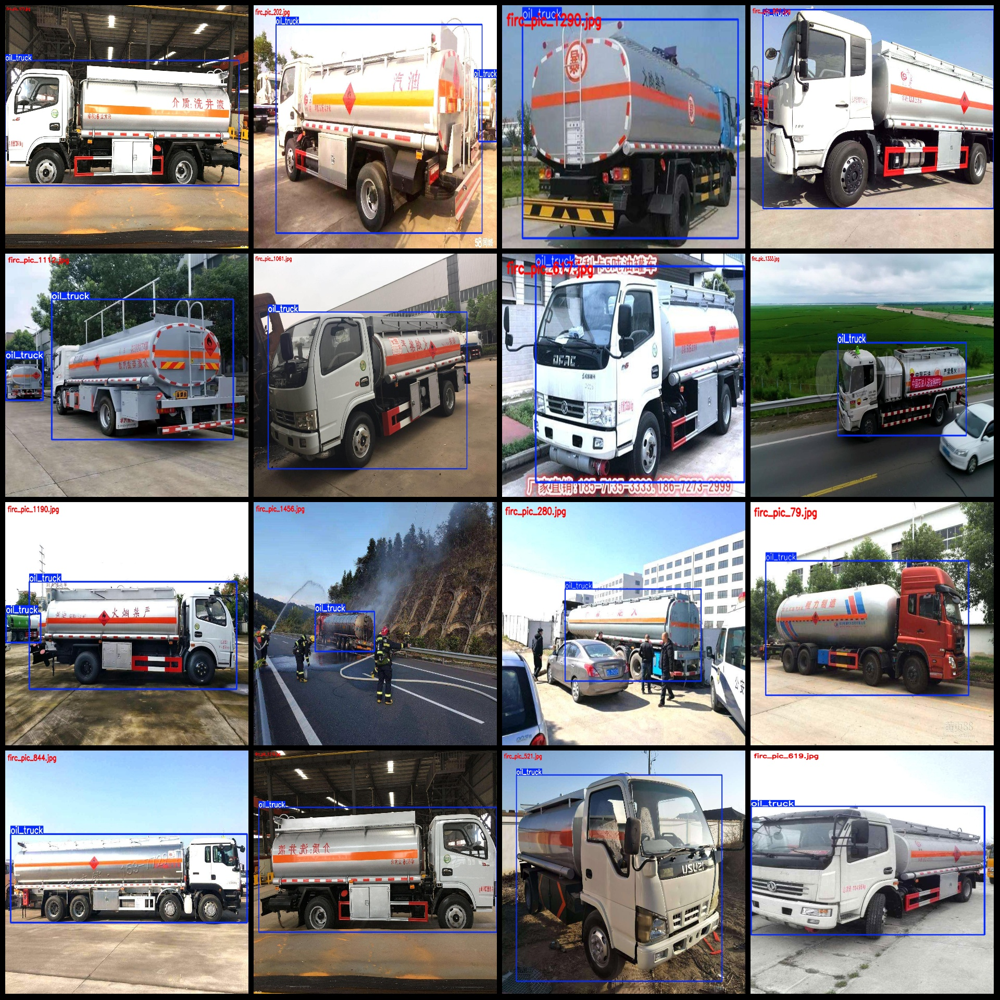
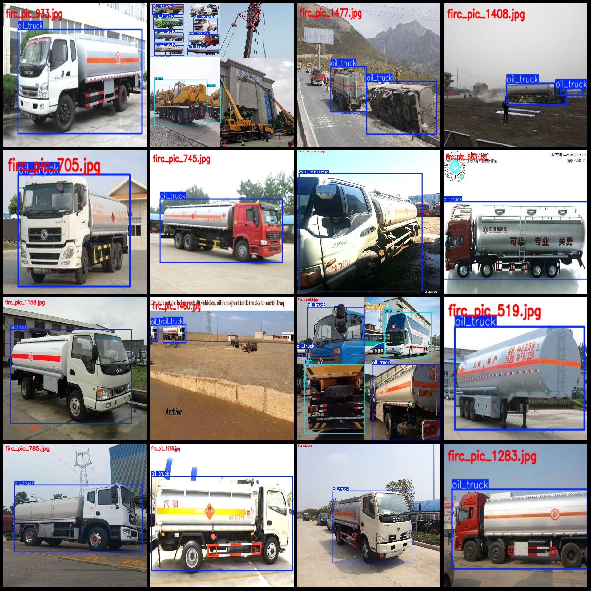

# Chemical Vehicles Detection Data Set - VOC+YOLO Format, 1499 Images in 3 Categories

The dataset format follows Pascal VOC and YOLO (without the split path in txt files, only containing jpg images along with their corresponding VOC XML files and YOLO txt files).

- Number of images (jpg file count): 1499
- Number of annotations (xml file count): 1499
- Number of annotations (txt file count): 1499
- Number of annotation categories: 3
- Annotation categories names (notice the order of labels in YOLO format does not match this, but refer to the "classes.txt" in the "labels" folder): ["bus", "oil_truck", "truck"]
- Box numbers for each category:
  - bus (public bus) box number = 98
  - oil_truck (oil tanker truck) box number = 2379
  - truck (truck) box number = 168
- Total box number: 2645
- Boxes per image for each category:
  - bus occupied images = 75
  - oil_truck occupied images = 1499
  - truck occupied images = 85
- Image resolutions: Multiple resolution images, such as 1080x810, 1333x768, etc.
- Annotation tool used: labelImg
- Annotation rules: draw boxes around categories
- Important note: The dataset does not have a split into training/validation/test sets; it needs to be divided by the user.
- Special declaration: This dataset does not guarantee any accuracy of the trained models or weights files.
- Image preview:
  - Example of annotation:
## Image

Here is a pay link on Stripe ( https://buy.stripe.com/3cs8yP7sY87d0vu9AB ). Please contact me lonlonago@foxmail.com after funding $89, and I will send you a complete data files , thank you!

